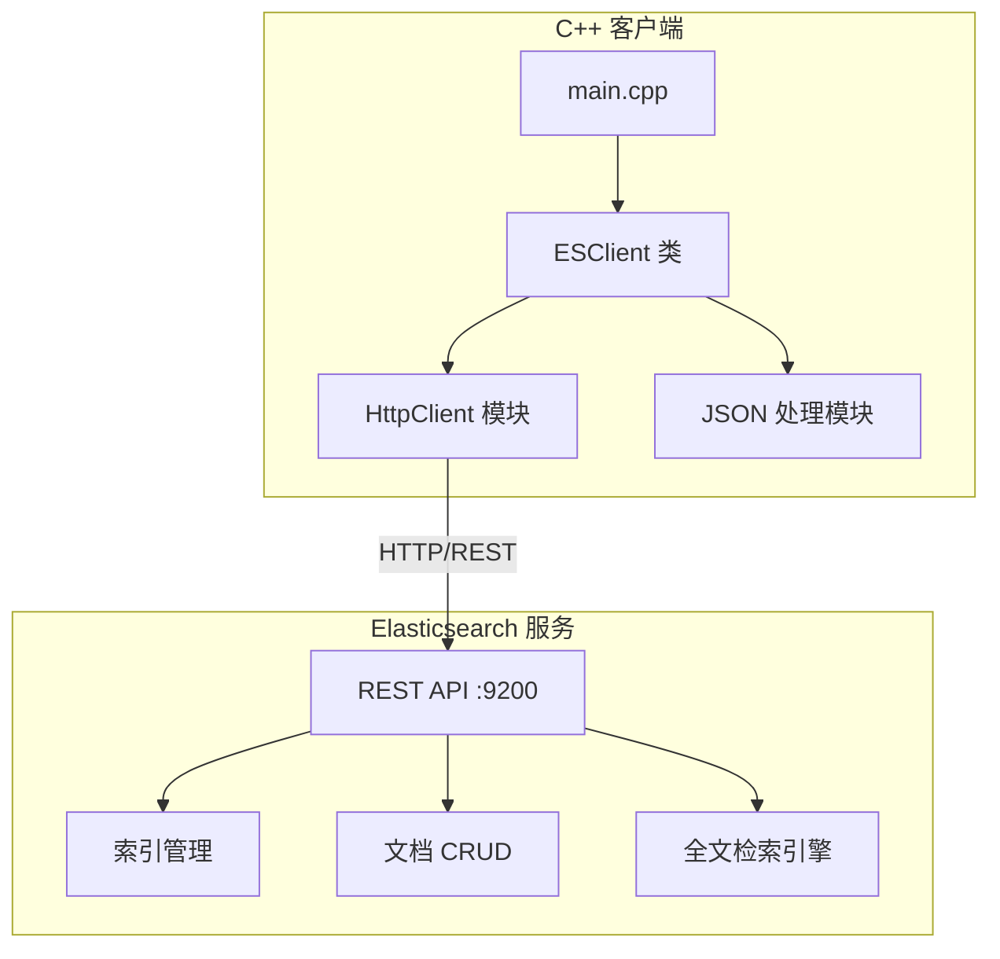
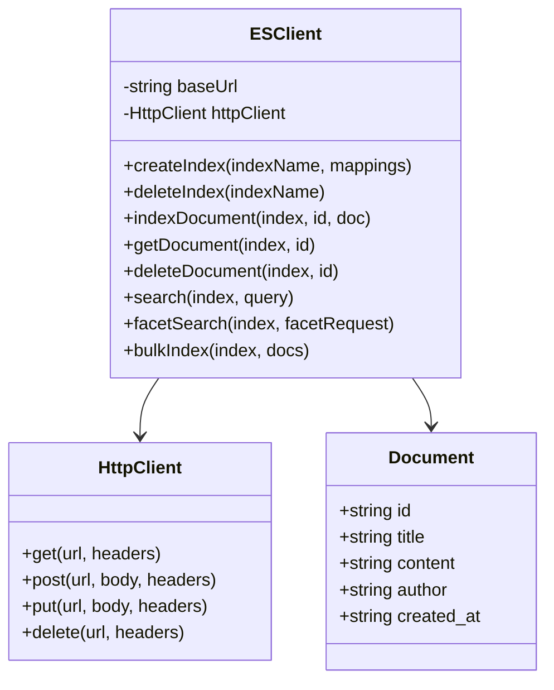

# Elasticsearch 全文检索 C++ 示例项目设计

## 1. 系统架构



## 2. 模块设计



## 3. 功能清单

| 功能模块 | 功能点     | 说明                           |
| -------- | ---------- | ------------------------------ |
| 索引管理 | 创建索引   | 支持自定义 mapping 和 settings |
| 索引管理 | 删除索引   | 删除指定索引                   |
| 索引管理 | 查看索引   | 获取索引信息                   |
| 文档操作 | 添加文档   | 单条/批量添加                  |
| 文档操作 | 获取文档   | 根据 ID 获取                   |
| 文档操作 | 更新文档   | 更新指定文档                   |
| 文档操作 | 删除文档   | 删除指定文档                   |
| 全文检索 | Match 查询 | 分词匹配查询                   |
| 全文检索 | Term 查询  | 精确匹配查询                   |
| 全文检索 | Bool 查询  | 组合条件查询                   |
| 全文检索 | 高亮显示   | 搜索结果高亮                   |
| 全文检索 | 分页查询   | 支持 from/size                 |
| 分面搜索 | 命中+统计  | 一次请求返回命中列表与分面统计 |
| 分面搜索 | 组合语义   | 分面内 OR、分面间 AND          |
| 分面搜索 | 分面桶     | 排除自身过滤的可选数量统计     |
| 分面搜索 | 参数校验   | 非法字段/倒置日期/越界分页拒绝 |

## 4. 分面搜索设计

选题场景要求"边看可选数量边缩小范围"：若把已选条件直接套在查询上，已选分类会把其他分类的计数压成零。因此采用**分离命中过滤与统计过滤**的经典 disjunctive faceting 方案，单次 `_search` 请求完成：

```json
{
  "query":       "<关键词查询，空关键词为 match_all>",
  "post_filter": "<全部分面条件 AND>（只影响命中列表，不影响聚合）",
  "aggs": {
    "facet_<field>": {
      "filter": "<除自身外的其他分面条件 AND>",
      "aggs": { "buckets": { "terms": { "field": "...", "size": N } } }
    }
  },
  "highlight": "<可选>",
  "from": 0, "size": 10
}
```

- **命中列表**：`query`（关键词）+ `post_filter`（同一分面内多选 `terms` 按 OR，不同分面按 AND；日期分面用 `range` 的 `gte`/`lt` 闭开区间）。
- **分面统计**：聚合不受 `post_filter` 影响，每个分面的 `filter` 聚合只套用**其他**分面的条件，因此已选值不会压缩本分面其他值的计数。
- **客户端加工**：桶按数量降序、同数按键名升序稳定排序；返回桶中缺失的已选值以零计数补回。
- **校验前置**：分面字段白名单（`category`/`author`/`tags`/`created_at`）、关键词与高亮字段白名单（`title`/`content`）、日期格式与先后关系、分页范围（`from >= 0`、`1 <= size <= 100`、`from + size <= 10000`）在拼查询前校验，违规直接抛 `ESException`。

## 5. API 接口设计

### 5.1 索引管理

- `PUT /{index}` - 创建索引
- `DELETE /{index}` - 删除索引
- `GET /{index}` - 获取索引信息

### 5.2 文档操作

- `POST /{index}/_doc/{id}` - 添加/更新文档
- `GET /{index}/_doc/{id}` - 获取文档
- `DELETE /{index}/_doc/{id}` - 删除文档
- `POST /{index}/_bulk` - 批量操作

### 5.3 搜索接口

- `POST /{index}/_search` - 搜索文档

## 6. 技术选型

| 组件        | 技术          | 版本  |
| ----------- | ------------- | ----- |
| 编程语言    | C++           | 17    |
| HTTP 客户端 | libcurl       | 7.x   |
| JSON 库     | nlohmann/json | 3.x   |
| 搜索引擎    | Elasticsearch | 8.x   |
| 构建工具    | CMake         | 3.16+ |
| 容器化      | Docker        | 20.x  |

## 7. 目录结构

```
es-cpp-demo/
├── backend/
│   ├── CMakeLists.txt
│   ├── Dockerfile
│   ├── include/
│   │   ├── es_client.hpp
│   │   ├── http_client.hpp
│   │   └── json.hpp
│   ├── src/
│   │   ├── main.cpp
│   │   ├── es_client.cpp
│   │   └── http_client.cpp
│   └── data/
│       └── sample_data.json
├── docker-compose.yml
├── .gitignore
├── README.md
└── docs/
    └── project_design.md
```
